# EfficientNetB3 for Animal Image Classification  
### A High-Accuracy Deep Learning Model for Mobile Deployment  
**Author:** Claudia (Claud-IA)  
**Version:** 2025  

---

## 📄 Abstract
This work presents a high-precision convolutional neural network for the classification of six animal species: **elephant**, **girafe**, **leopard**, **rhino**, **tigre**, **zebre**.  
We evaluate several pretrained convolutional backbones—including MobileNetV2 and EfficientNetB3—and demonstrate that **EfficientNetB3 with partial fine-tuning** achieves state-of-the-art performance with **~99% test accuracy**, robust per-class F1 scores, and minimal confusion between visually similar species.

The final model is exported to **TensorFlow Lite**, enabling real-time inference on mobile devices using Flutter.  

---

## 1. Introduction
Image classification is a core task in computer vision and is particularly relevant for mobile applications.  
This project explores:

- CNN backbone comparison  
- Fine‑tuning strategies  
- Confusion reduction  
- Deployment to TFLite & Flutter  

---

## 2. Dataset Description

### 2.1 Classes
- elephant  
- girafe  
- leopard  
- rhino  
- tigre  
- zebre  

### 2.2 Distribution

| Split | Images |
|-------|--------|
| Train | 20,400 |
| Validation | 3,600 |
| Test | 6,000 |

### 2.3 Directory Structure
```
data/
  train/
  validation/
  test/
```

---

## 3. Methodology

### 3.1 Preprocessing
- 224×224×3 images  
- Pixel range: 0–255  
- EfficientNet `preprocess_input`  
- Data augmentation:
  - Rotation ±15°
  - Shifts 10%
  - Zoom 15%
  - Shear 10%
  - Horizontal flip
  - Brightness range 0.85–1.15  

---

## 4. Model Architecture

### 4.1 Overview Diagram

```mermaid
flowchart TD
    A[Input Image 224×224×3] --> B[EfficientNetB3 Backbone]
    B --> C[GlobalAveragePooling2D]
    C --> D[Dropout 0.3]
    D --> E[Dense 256 + BatchNorm + ReLU]
    E --> F[Dropout 0.5]
    F --> G[Dense 6 Softmax]
    G --> H[Output Probabilities]
```


### 4.2 Detailed Head Architecture
```
GlobalAveragePooling2D
↓
Dropout(0.3)
↓
Dense(256) + BatchNormalization + ReLU
↓
Dropout(0.5)
↓
Dense(6, activation="softmax")
```

---

## 5. Experimental Setup

### 5.1 Training Parameters

| Phase | Backbone | Trainable Layers | LR | Epochs |
|-------|----------|------------------|-----|---------|
| Phase 1 | Frozen | 0 | 1e-3 | 15 |
| Phase 2 | ~80% unfrozen | Most layers | 1e-4 | 50 max |

### 5.2 Callbacks
- EarlyStopping(patience=10)  
- ReduceLROnPlateau(factor=0.5, patience=3)  
- ModelCheckpoint(save_best_only=True)  

---

## 6. Ablation Study (Model Comparison)

### 6.1 Summary Table

| Model | Test Accuracy | Notes |
|--------|----------------|-----------|
| MobileNetV2 | 97–98% | High confusion rhino/elephant |
| EfficientNetB0 | ~98.3% | Stable but lower precision |
| EfficientNetB3 (Phase 1) | ~98.5% | Good base |
| **EfficientNetB3 + Fine-Tuning** | **~99%** | Best performer |

### 6.2 Impact of Parameter Changes

| Parameter | Effect |
|-----------|--------|
| LR 1e-3 → 1e-4 | Stability improved |
| Freezing 100% → 20% | Better deep features |
| Dropout 0.3 → 0.5 | Overfitting reduced |
| Class weights ×2 | Reduced rhino confusion |
| Stronger augmentation | Better generalization |

---

## 7. Results

### 7.1 Classification Report

| Class | Precision | Recall | F1 |
|--------|-----------|--------|------|
| elephant | 0.99 | 0.98 | 0.98 |
| girafe | 1.00 | 0.99 | 1.00 |
| leopard | 0.99 | 0.99 | 0.99 |
| rhino | 0.98 | 0.99 | 0.98 |
| tigre | 1.00 | 1.00 | 1.00 |
| zebre | 0.99 | 1.00 | 1.00 |

### 7.2 Global Metrics
- Accuracy: **~99%**
- Macro F1: **0.99**
- Weighted F1: **0.99**

### 7.3 Confusion Matrix Notes
- Rhino↔Elephant confusion drastically reduced  
- Tigre & Zebre ~997/1000 correct  

---

## 8. TFLite Export & Verification

### 8.1 Conversion Code
```python
converter = tf.lite.TFLiteConverter.from_keras_model(model)
tflite_model = converter.convert()
with open("cnn_model_animals_2025.tflite", "wb") as f:
    f.write(tflite_model)
```

### 8.2 Validation
- Max absolute difference vs Keras: **0.000119**  
➡️ Nearly identical outputs  

---

## 9. Flutter Deployment

- Interpreter: `tflite_flutter`  
- Input tensor: `[1, 224, 224, 3]` float32  
- Pixel range: 0–255  
- Output: Softmax(6)  
- Labels: `model_labels.txt`

---

## 10. Conclusion
EfficientNetB3 with partial fine‑tuning achieves:
- Near‑perfect accuracy  
- Low confusion on similar classes  
- Real‑time performance in mobile environments  

This model is suitable for wildlife apps, educational tools, and AI‑powered image recognition on‑device.

---

## 11. Future Work
- Quantization-aware training  
- Knowledge distillation  
- Grad-CAM visualizations  
- Dataset expansion  

---

## 12. References
- Tan & Le (2019). EfficientNet.  
- Howard et al. (2017). MobileNet.  
- TensorFlow Lite Documentation.  
