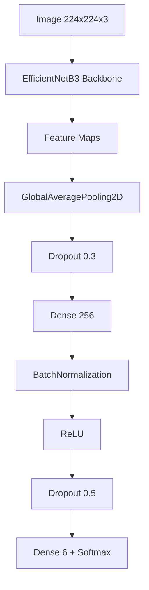

# 🧠 Classification d’Animaux par CNN  
## EfficientNetB3 · TensorFlow · TensorFlow Lite · Flutter

---

## 1. Objectif du projet

Ce projet vise à concevoir, entraîner et déployer un **modèle de classification d’images**
capable de reconnaître **6 animaux** :

- Elephant  
- Girafe  
- Léopard  
- Rhinocéros  
- Tigre  
- Zèbre  

Le modèle final est :
- entraîné avec **TensorFlow / Keras**
- optimisé via **transfer learning**
- exporté en **TensorFlow Lite (TFLite)**
- intégré dans une **application mobile Flutter**

---

## 2. Organisation du dataset

Structure attendue par Keras :

```
dataset/
├── train/
│   ├── elephant/
│   ├── girafe/
│   ├── leopard/
│   ├── rhino/
│   ├── tigre/
│   └── zebre/
├── validation/
└── test/
```

Chaque dossier représente une classe.

---

## 3. Pipeline de données

### 3.1 Prétraitement

- Redimensionnement : **224 × 224**
- Images RGB
- Normalisation : `rescale = 1/255`
- Chargement par batch (32)

### 3.2 Augmentation de données

- Rotation
- Zoom
- Flip horizontal
- Translation

Objectif : **réduire l’overfitting** et améliorer la généralisation.

---

## 4. Déséquilibre des classes (Class Weights)

### 4.1 Problématique

Certaines classes sont sous-représentées → biais du modèle.

### 4.2 Solution

Utilisation de `class_weight` dans `model.fit()`.

### 4.3 Formule

Soit :
- N : nombre total d’images
- K : nombre de classes
- n_c : images de la classe c

```
w_c = N / (K × n_c)
```

---

## 5. Architecture du modèle

### 5.1 Principe

- Backbone pré-entraîné **EfficientNetB3**
- Extraction automatique de features
- Tête de classification personnalisée

### 5.2 Diagramme du modèle



---

## 6. Calcul des paramètres (poids)

### 6.1 Dense

Formule :

```
(n_in × n_out) + n_out
```

Exemple :

```
(1536 × 256) + 256 = 393 472 paramètres
```

### 6.2 Convolution

Formule :

```
(kh × kw × Cin × Cout) + Cout
```

Exemple :

```
(3 × 3 × 32 × 64) + 64 = 18 496 paramètres
```

---

## 7. Fonctionnement d’une convolution

### 7.1 Principe

- Un filtre glisse sur l’image
- Calcul d’un produit scalaire local
- Génération d’une carte de caractéristiques

### 7.2 Exemple

Image :

```
1 2 0
0 1 3
2 1 1
```

Filtre :

```
1  0 -1
1  0 -1
1  0 -1
```

Résultat : **détection de bord vertical**

---

## 8. Stratégie d’entraînement

### Phase 1 — Tête seule

- Backbone gelé
- Apprentissage rapide et stable

### Phase 2 — Fine-tuning

- Dégel partiel du backbone
- Learning rate réduit
- Ajustement fin aux textures animales

---

## 9. Évaluation

- Accuracy
- Matrice de confusion
- Precision / Recall / F1-score
- Analyse des erreurs inter-classes

---

## 10. Export TensorFlow Lite

- Conversion Keras → TFLite
- Optimisation activée

```python
converter.optimizations = [tf.lite.Optimize.DEFAULT]
```

Fichiers générés :
- model.tflite
- labels.txt
- confusion_matrix.png
- training_history.png

---

## 11. Déploiement Flutter

- Inférence locale
- Rapidité
- Fonctionnement hors ligne
- Confidentialité des données

---

## 12. Conclusion

Ce projet couvre l’ensemble du cycle :
**Dataset → Entraînement → Évaluation → Mobile AI**

Il démontre une maîtrise :
- des CNN
- du transfer learning
- du déploiement mobile IA

---

✍️ Auteur : Claud-IA  
📅 Année : 2025  
