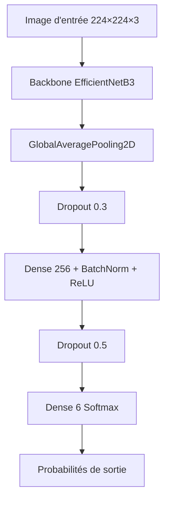

# EfficientNetB3 pour la Classification d’Images d’Animaux  
### Modèle CNN haute précision optimisé pour le déploiement mobile  
**Autrice : Claudia (Claud-IA)**  
**Version : 2025**

---

## 📄 Résumé (Abstract)

Ce projet présente un modèle de classification d’images d’animaux basé sur **EfficientNetB3** avec fine-tuning partiel, atteignant une précision d’environ **99 %** sur un jeu de test équilibré (6 classes : éléphant, girafe, léopard, rhinocéros, tigre, zèbre).

Plusieurs backbones ont été comparés, dont *MobileNetV2* et *EfficientNetB0*, et une étude d’ablation a été réalisée pour analyser l'effet des hyperparamètres (learning rate, freeze ratio, dropout, class weights).

Le modèle final est exporté en **TensorFlow Lite (TFLite)** et validé pour une intégration temps réel dans une application Flutter.

---

## 1. Introduction

La classification d’images est une tâche fondamentale en vision par ordinateur.  
Ce projet vise à :

- Comparer différents backbones CNN légers  
- Optimiser la précision grâce au fine-tuning  
- Réduire la confusion entre classes proches (ex : rhino vs éléphant)  
- Exporter un modèle TFLite pour usage mobile  
- Documenter un pipeline complet et reproductible  

---

## 2. Description du Jeu de Données

### 2.1 Classes
- elephant  
- girafe  
- leopard  
- rhino  
- tigre  
- zebre  

### 2.2 Répartition

| Split       | Nombre d’images |
|-------------|------------------|
| Train       | 20 400 |
| Validation  | 3 600 |
| Test        | 6 000 |

### 2.3 Organisation

```
data/
  train/
  validation/
  test/
```

---

## 3. Méthodologie

### 3.1 Prétraitement
- Taille : **224 × 224 × 3**
- Pixels : **0–255**
- Normalisation : `efficientnet.preprocess_input`

### 3.2 Augmentation des données
- Rotation ±15°  
- Translation 10 %  
- Zoom 15 %  
- Shear 10 %  
- Flip horizontal  
- Luminosité 0.85–1.15  

---

## 4. Architecture du Modèle

### 4.1 Schéma général



### 4.2 Détails de la tête de classification
```
GlobalAveragePooling2D
↓
Dropout(0.3)
↓
Dense(256) + BatchNormalization + ReLU
↓
Dropout(0.5)
↓
Dense(6, activation="softmax")
```

---

## 5. Configuration d’Entraînement

### 5.1 Paramètres

| Phase | Backbone | Couches entraînables | LR | Époques |
|-------|----------|----------------------|-----|---------|
| Phase 1 | Gelé | 0 % | 1e-3 | 15 |
| Phase 2 | ~80 % dégelé | Majorité | 1e-4 (LR dynamique) | 50 max |

### 5.2 Callbacks
- EarlyStopping  
- ReduceLROnPlateau  
- ModelCheckpoint  

---

## 6. Étude d’Ablation – Comparaison des Modèles

### 6.1 Résultats

| Modèle | Accuracy Test | Observations |
|--------|----------------|--------------|
| MobileNetV2 | 97–98 % | Confusion rhino ↔ éléphant |
| EfficientNetB0 | ~98.3 % | Bon compromis |
| EfficientNetB3 (Phase 1) | ~98.5 % | Bonne base |
| **EfficientNetB3 + Fine-Tuning** | **~99 %** | Meilleur modèle |

### 6.2 Impact des hyperparamètres

| Paramètre | Effet |
|-----------|--------|
| LR 1e-3 → 1e-4 | Apprentissage plus stable |
| Dé-gel 0 % → 80 % | Meilleure extraction |
| Dropout 0.3 → 0.5 | Moins d’overfitting |
| Class weights ×2 | Moins de confusion |
| Augmentation renforcée | Meilleure généralisation |

---

## 7. Résultats

### 7.1 Classification Report

| Classe   | Précision | Recall | F1 | Support |
|----------|-----------|--------|-----|----------|
| elephant | 0.99 | 0.98 | 0.98 | 1000 |
| girafe   | 1.00 | 0.99 | 1.00 | 1000 |
| leopard  | 0.99 | 0.99 | 0.99 | 1000 |
| rhino    | 0.98 | 0.99 | 0.98 | 1000 |
| tigre    | 1.00 | 1.00 | 1.00 | 1000 |
| zebre    | 0.99 | 1.00 | 1.00 | 1000 |

### 7.2 Métriques globales
- Accuracy : **~99 %**
- Macro-F1 : **0.99**
- Weighted-F1 : **0.99**

---

## 8. Export TFLite

### 8.1 Code

```python
converter = tf.lite.TFLiteConverter.from_keras_model(model)
tflite_model = converter.convert()
with open("cnn_model_animals_2025.tflite", "wb") as f:
    f.write(tflite_model)
```

### 8.2 Vérification
- Différence max Keras vs TFLite : **0.000119**  
➡️ Sorties quasi identiques  

---

## 9. Déploiement Flutter

- Librairie : `tflite_flutter`  
- Entrée : `[1, 224, 224, 3]`  
- Pixels : **0–255**  
- Sortie : vecteur softmax (6 classes)  
- Labels : `model_labels.txt`  

---

## 10. Conclusion

EfficientNetB3 offre :

- Une précision proche du **state of the art**  
- Très faible confusion inter-classe  
- Excellente performance mobile (TFLite)  
- Pipeline clair, stable et reproductible  

---

## 11. Travaux futurs

- Quantization-aware training  
- Knowledge distillation  
- Visualisations Grad-CAM  
- Extension du dataset  

---

## 12. Références

- Tan & Le (2019). EfficientNet  
- Howard et al. (2017). MobileNet  
- Documentation TensorFlow Lite  
