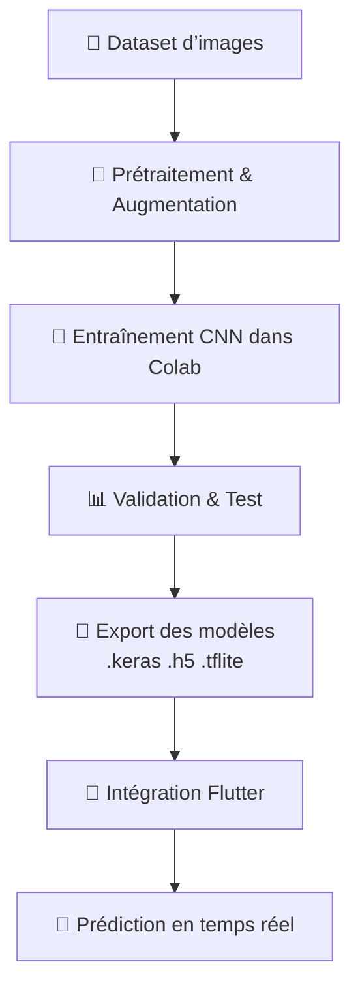
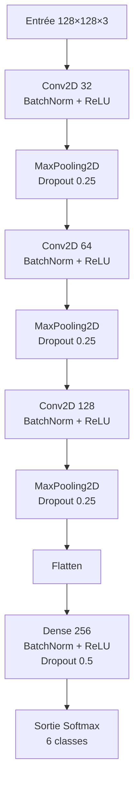

# 📘 Project_CNN_Flutter — Classification d’Images avec TensorFlow, TFLite et Flutter  
README complet en français

---

# 🦁 Introduction

Ce projet met en œuvre une chaîne complète de vision par ordinateur incluant :

- Préparation d’un dataset d’animaux  
- Entraînement d’un modèle CNN dans Google Colab (GPU)  
- Export du modèle en `.keras`, `.h5`, `.tflite`  
- Génération du fichier `labels.txt`  
- Intégration du modèle dans une application Flutter via TFLite  

---

# 📂 Structure du projet

```
Project_cnn_flutter/
│
├── entrainement/
├── validation/
├── test/
│
├── models/
│   ├── cnn_animaux.h5
│   ├── cnn_animaux.keras
│   ├── cnn_animaux.tflite
│   ├── labels.txt
│
├── 1_Modele.py
└── README.md
```

---

# 🧠 1. Pipeline général

## 1.1 Diagramme UML



---

# 🧭 2. Préparation dans Google Colab

## 2.1 Activer GPU

Menu : Exécution → Modifier le type d’exécution → GPU

```python
import tensorflow as tf
print(tf.config.list_physical_devices('GPU'))
```

---

## 2.2 Cloner le dépôt

```python
!git clone https://github.com/ClaFlorez/Project_cnn_flutter.git
```

---

## 2.3 Chemins du dataset

```python
DATA_PATHS = {
    'train': '/content/Project_cnn_flutter/entrainement',
    'validation': '/content/Project_cnn_flutter/validation',
    'test': '/content/Project_cnn_flutter/test'
}
```

---

# 🧩 3. Génération des données

```python
from tensorflow.keras.preprocessing.image import ImageDataGenerator

train_datagen = ImageDataGenerator(
    rescale=1./255,
    rotation_range=20,
    width_shift_range=0.2,
    height_shift_range=0.2,
    zoom_range=0.2,
    shear_range=0.2,
    horizontal_flip=True,
    fill_mode='nearest'
)

val_test_datagen = ImageDataGenerator(rescale=1./255)
```

Chargement :

```python
train_generator = train_datagen.flow_from_directory(DATA_PATHS['train'], target_size=(128,128), batch_size=32, class_mode='categorical')
validation_generator = val_test_datagen.flow_from_directory(DATA_PATHS['validation'], target_size=(128,128), batch_size=32, class_mode='categorical')
test_generator = val_test_datagen.flow_from_directory(DATA_PATHS['test'], target_size=(128,128), batch_size=32, class_mode='categorical')
```

---

# 🏗️ 4. Architecture CNN

## 4.1 Schéma de l’architecture



---

## 4.2 Code du modèle CNN

```python
from tensorflow.keras.models import Sequential
from tensorflow.keras.layers import (
    Input, Conv2D, MaxPooling2D, BatchNormalization,
    Activation, Dropout, Flatten, Dense
)
import tensorflow as tf

def create_cnn_model(input_shape, num_classes):

    model = Sequential()
    model.add(Input(shape=input_shape))

    model.add(Conv2D(32, (3,3), padding='same'))
    model.add(BatchNormalization())
    model.add(Activation('relu'))
    model.add(MaxPooling2D(2,2))
    model.add(Dropout(0.25))

    model.add(Conv2D(64, (3,3), padding='same'))
    model.add(BatchNormalization())
    model.add(Activation('relu'))
    model.add(MaxPooling2D(2,2))
    model.add(Dropout(0.25))

    model.add(Conv2D(128, (3,3), padding='same'))
    model.add(BatchNormalization())
    model.add(Activation('relu'))
    model.add(MaxPooling2D(2,2))
    model.add(Dropout(0.25))

    model.add(Flatten())
    model.add(Dense(256))
    model.add(BatchNormalization())
    model.add(Activation('relu'))
    model.add(Dropout(0.5))

    model.add(Dense(num_classes, activation='softmax'))

    model.compile(
        optimizer=tf.keras.optimizers.Adam(0.001),
        loss='categorical_crossentropy',
        metrics=['accuracy']
    )

    return model
```

---

# 🧮 4.3 Détails des couches + paramètres

| Couche | Sortie | Paramètres |
|-------|---------|-----------:|
| Conv2D 32 | 128×128×32 | 896 |
| BatchNorm 32 | 128×128×32 | 128 |
| Conv2D 64 | 64×64×64 | 18 496 |
| BatchNorm 64 | 64×64×64 | 256 |
| Conv2D 128 | 32×32×128 | 73 856 |
| BatchNorm 128 | 32×32×128 | 512 |
| Dense 256 | 256 | 8 388 864 |
| Dense final 6 | 6 | 1 542 |

**Total ≈ 8 485 574 paramètres**

---

# 🎯 5. Entraînement

```python
from tensorflow.keras.callbacks import EarlyStopping, ModelCheckpoint

callbacks = [
    EarlyStopping(monitor='val_loss', patience=4, restore_best_weights=True),
    ModelCheckpoint("/content/drive/MyDrive/models/cnn_best.keras", save_best_only=True)
]

history = model.fit(
    train_generator,
    validation_data=validation_generator,
    epochs=20,
    callbacks=callbacks
)
```

---

# 📊 6. Évaluation

```python
test_loss, test_acc = model.evaluate(test_generator)
print("Accuracy test :", test_acc)
```

---

# 💾 7. Export des modèles

### `.keras` (nouveau format recommandé)

```python
model.save("/content/drive/MyDrive/models/cnn_animaux.keras")
```

### `.h5` (legacy)

```python
model.save("/content/drive/MyDrive/models/cnn_animaux.h5")
```

### `.tflite` (pour Flutter)

```python
converter = tf.lite.TFLiteConverter.from_keras_model(model)
tflite = converter.convert()
open("/content/drive/MyDrive/models/cnn_animaux.tflite", "wb").write(tflite)
```

---

# 🏷️ 8. Génération des labels

```python
with open("/content/drive/MyDrive/models/labels.txt", "w") as f:
    for label in train_generator.class_indices.keys():
        f.write(label + "\n")
```

---

# 📱 9. Intégration dans Flutter

### Ajouter les modèles :

```
assets/models/
    cnn_animaux.tflite
    labels.txt
```

### pubspec.yaml

```yaml
flutter:
  assets:
    - assets/models/cnn_animaux.tflite
    - assets/models/labels.txt
```

### Charger modèle

```dart
final interpreter = await Interpreter.fromAsset('models/cnn_animaux.tflite');
```

---

# 🎉 10. Résultat

✔ CNN fonctionnel  
✔ Export complet  
✔ Application Flutter opérationnelle  
✔ Documentation professionnelle  
✔ Pipeline reproductible  

FIN.
